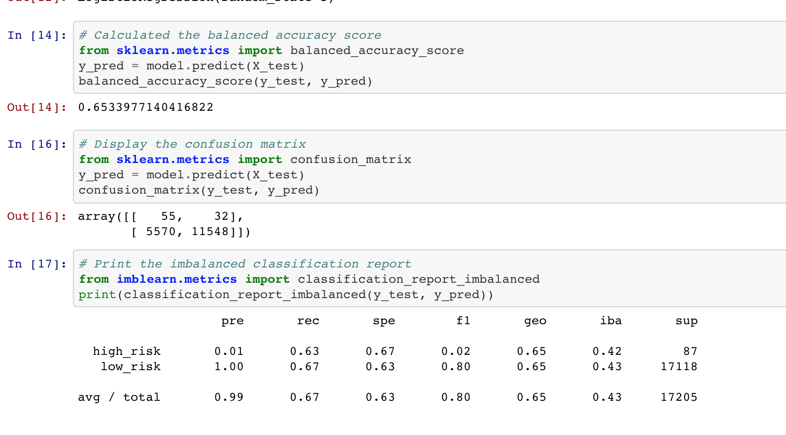
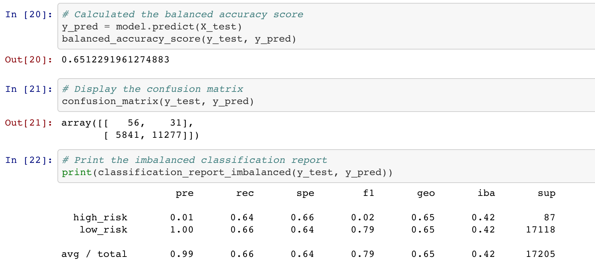
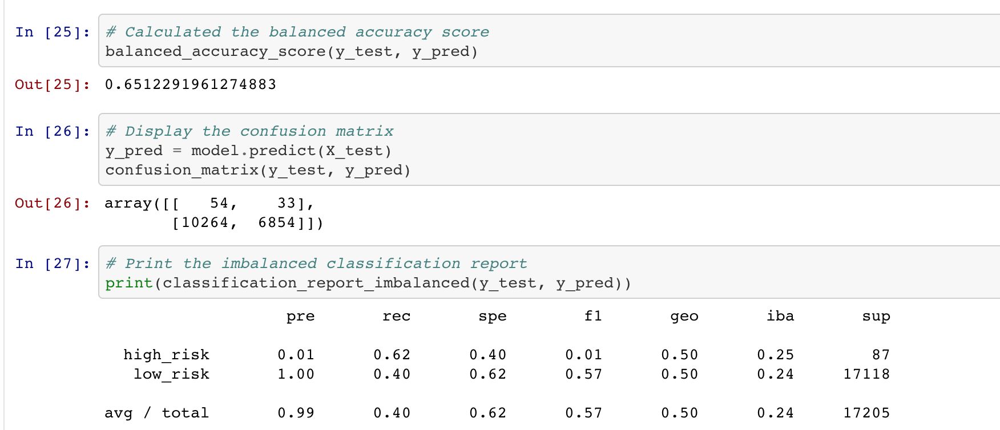
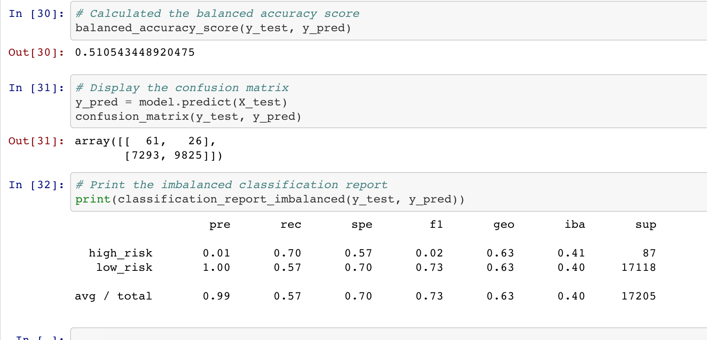
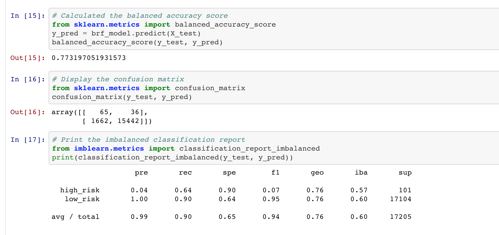
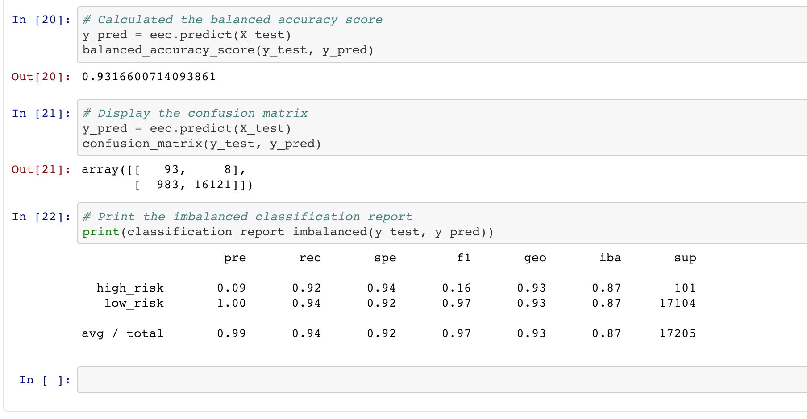

# Credit_Risk_Analysis

## Project Overview

The purpose of this analysis was to apply machine learning to predict credit risk for a lending services company. We adopted the following procedure to run this analysis : 

1. Random Over Sampler 
2. SMOTE 
3. Cluster Centroids 
4. SMOTEEN
5. Balanced Random Forest Classifier
6. Easy Ensemble Classifier

**RESAMPLING:**

1. Naive Random Oversampling

The balanced accuracy score is 65%. The high_risk precision is 1% with 63% sensitivity, the low_risk precision is 100% with a sensitivity of 67%. 

2. SMOTE Oversampling

The balanced accuracy score is 65%. The high_risk precision is 1% with 64% sensitivity, the low_risk precision is 100% with a sensitivity of 66%. 

3. Cluster Centroid Undersampling

The balanced accuracy score is 65%. The high_risk precision is 1% with 62% sensitivity, the low_risk precision is 100% with a sensitivity of 40%. 

4. SMOTEENN Combo Sampling (Over and Under)

The balanced accuracy score is 51%. The high_risk precision is 1% with 70% sensitivity, the low_risk precision is 100% with a sensitivity of 57%. 

**ENSEMBLE:**

1. Balanced Random Forest Classifier

The balanced accuracy score is 77%. The high_risk precision is 4% with 64% sensitivity, the low_risk precision is 100% with a sensitivity of 90%. 

2. Easy Ensemble AdaBoost Classifier

The balanced accuracy score is 93%. The high_risk precision is 9% with 92% sensitivity, the low_risk precision is 100% with a sensitivity of 94%. 

## Summary

The model with the highest accuracy score was the Easy Ensemble Classifier. 
The accuracy scores of the first four resampling models are very low compared to the last two Ensemble models.
The high risk recall was at 93%. 
None of the models could precisely predict high risk predictions.
The low risk precision is 100% in all the models due to high numbers.

I would recommend none of these models to predict credit risk. But the last two model (Ensemble models) would be better among the selection of these 6 models.